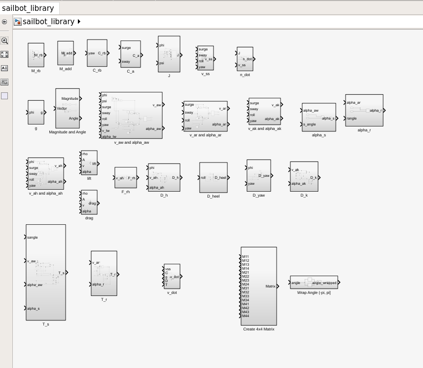
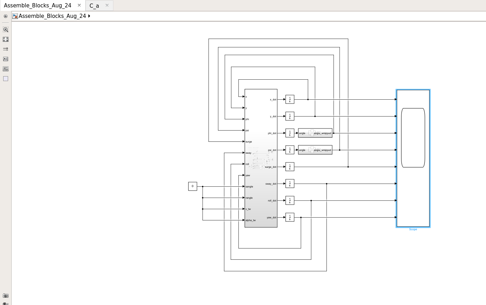
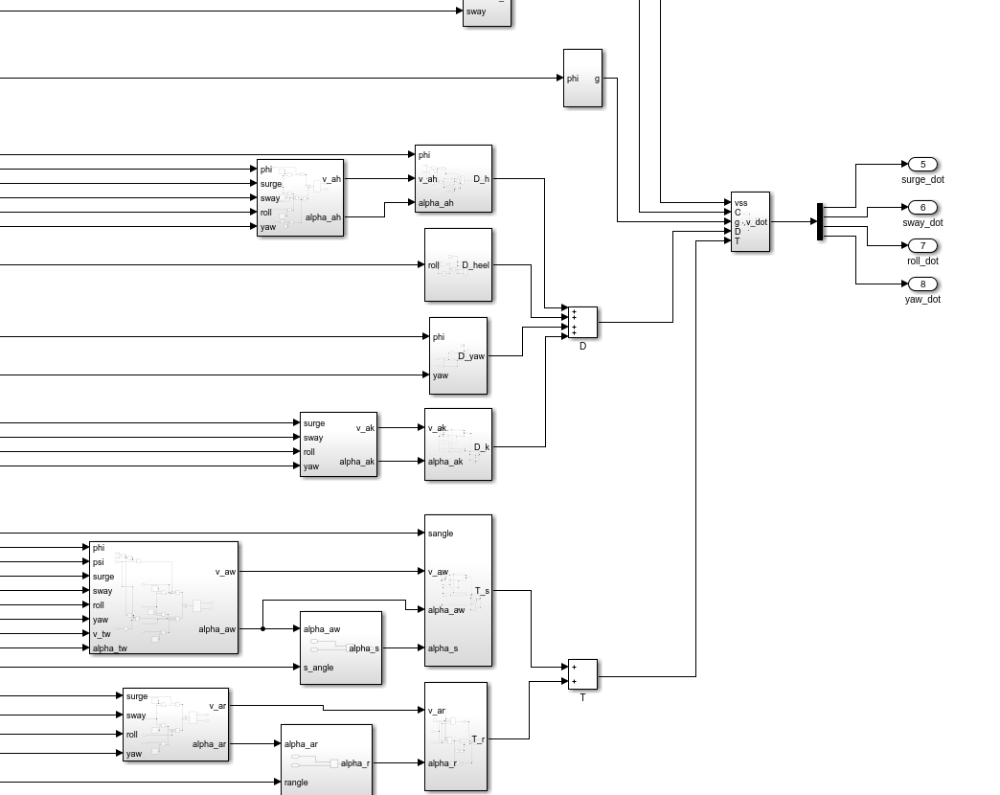

# boat-simulator

This repository contains MATLAB scripts and Simulink models for the purpose of creating an MPC controller for UBC Sailbot. As of Aug 2019, all the equations are based off of _Modeling and Nonlinear Heading Control of Sailing Yachts_ by Jerome Jouffroy. The pdf can be found [here](Jouffroy-2013linjoe.pdf). 

# Overview of the Model

To build an MPC controller we need to first build a boat mathematical model that accurately captures the dynamics of the boat. This is the most important, challenging, and time-consuming part of the controller. From there, we can make a simple controller that uses the model to choose appropriate actions to navigate to where we want the boat to go.

The model input variables that we control are the rudder and sail angle of the boat. The model input variables that we don't control are the wind speed and direction. The state variables that we care about are the boats x-y position and roll-yaw angle, as well as their derivatives. We ignore the z position and pitch angle in this model.

# Quick Start Instructions (working as of Aug 2019)

1. Install MATLAB and Simulink. This is free for UBC students, with instructions [here](https://it.ubc.ca/services/desktop-print-services/software-licensing/matlab). Note: for Linux, this is a bit more complicated. Contact Tyler Lum if you have any issues setting it up.

2. Clone the repository `git clone https://github.com/UBCSailbot/boat-simulator.git`

3. Open MATLAB and find the folder to `boat-simulator` that you just cloned (folders shown on left)

4. Find `Constants_Aug_2019.m` and run the script. This loads the constants of the Simulink model into your workspace. Please keep this file updated to match `Simulink_models/Assemble_Blocks_Aug_24.slx`. If it tells you it can't run from where you are, always choose Move to Folder, not Add to Path. If you do not run this, the Simulink model will complain that its variables are undefined.

5. Find `Simulink_models/sailbot_library.slx` and double click it. If there are any issues with this, install the toolboxes needed to get this open. This opens the library that has the Simulink blocks that we defined. This is where all the equations from the paper are defined. If there are any bugs in the system, it is likely contained in these blocks. Please note that if you change a block here, it automatically changes the same blocks used in `Simulink_models/Assemble_Blocks_Aug_24.slx`. Please make all equation related blocks and block changes here. Note: you need to unlock the library to make changes (try to change something. A warning will pop up and click the unlock library link in the warning). If you do not run this line, the Simulink model will complain that it cannot find the blocks. If you would like to investigate a block, double click on it to see what is inside.

_sailbot_library.slx as of Aug 2019_

6. Find `Simulink_models/Assemble_Blocks_Aug_24.slx` and double click it. If there are any issues with this, install the toolboxes needed to get this open. This opens the Simulink library that assembles the blocks from `Simulink_models/sailbot_library.slx`. If there are any bugs connecting blocks, they will be here. If there is an error related to a block, please make the change in `Simulink_models/sailbot_library.slx`, not here. This will make your changes save in a more reliable way. Depending on the state of the system, you may need to double click on the blocks to see what is inside of them. 

_Assemble_Blocks_Aug_24.slx as of Aug 2019_

_Inside Assemble_Blocks_Aug_24.slx as of Aug 2019_

7. To run, ensure that `rangle, sangle, v_tw, alpha_tw` are set to appropriate constants or functions (if not, click anywhere in background, write "constant" ENTER to make a constant block. Connect this with the variable). Ensure that the outputs of the system you want to view have scopes at the end (if not, click anywhere in background, write "scope" ENTER to make a scope block. Connect this with the output). Then define how long the model should run in the middle of the top bar. Then press the green start button to start. From there, you can double click the scopes on the right to view a plot of their values.  

8. Review `symless_nonlinear.m` to understand what the Simulink blocks should be doing and see the page numbers that the equations correspond to in Jouffroy paper. Review the Jouffroy paper in this repository if you need more detailed information. Confirm that the paper matches `symless_nonlinear.m` and `symless_nonlinear.m` matches `Simulink_models/Assemble_Blocks_Aug_24.slx`. 

9. Continuously update `Simulink_models/Assemble_Blocks_Aug_24.slx`, `Simulink_models/sailbot_library.slx`, `symless_nonlinear.m`, and `Constants_Aug_2019.m`. Eventually make new files with newer dates. Binary files are hard to understand diffs, so nicer to make new files once in a while.

# Description

As of Aug 2019, we have had the following design changes.

* We started off by creating a model of the boat using the Jouffroy paper using the MATLAB Symbolic Toolbox in `nonlinear_sailboat_motion.m` (written by Nick). The goal was to use it to linearize the model for the controller. This was a great starting point, but the Symbolic Toolbox had issues with finding the x-y components of zero-vectors. This led to division by zeros that broke the model. In addition, the model was unstable and difficult to debug using the Symbolic Toolbox. 

* Next, we created `symless_nonlinear.m` to recreate what was done in `nonlinear_sailboat_motion.m`, but without the Symbolic Toolbox (Bruce and Tyler). This was in hopes of solving the division by zero problem and then debugging from there. This solution still encountered many issues and was not easy to debug, visualize or improve.

* Next, we created `sailbot_library.slx`, which contains Simulink blocks that match the equations of `symless_nonlinear.m`. Then we assembled the blocks in `Simulink_models/Assemble_Blocks_Aug_24.slx`, and then began debugging the system. So far, the division by zero issue seems to be gone, but the boat is still unstable. We are hoping to figure out the cause of the problems and then work from there (eg. sign error, parameter estimate issues, lift/drag/F_rh approximation errors, etc.)

# Variables

There are many variables in this complicated model. While the Jouffroy paper does a good job explaining the varibles, it is long and overwhelming to read and understand. Here, I will define the variables more clearly and highlight some easy misunderstandings (as of Aug 2019):

* Two notable coordiate frames:

    * n-frame - world frame with xyz = North-East-Down
    
    * b-frame - boat frame with xyz = Forward-Right-Down
    
* n = [x;y;phi;psi]

    * x - position in n-frame
    
    * y - position in n-frame
    
    * phi - angle around x-axis in n-frame
    
    * psi - angle around z-axis in n-frame
    
* vss = [surge;sway;roll;yaw]

    * surge - linear velocity forward in b-frame (u in paper)
    
    * sway - linear velocity right in b-frame (v in paper)
    
    * roll - angular velocity around x-axis in b-frame (p in paper)
    
    * yaw - angular velocity around z-axis in b-frame (r in paper)
    
* n_dot, v_dot - time derivatives of above variables

All of the following variables are vectors with 4 components, with the components directions matching vss above. This means component 1 is forward, 2 is right, 3 is angular around forward-axis, 4 is angular around down-axis.

* T - vector of propulsive forces (from rudder and sail)

* D - vector of damping forces

* g - vector of righting moments

All of the following are parameters that must be tuned/tested (not exhaustive list)

* (x_r, y_r, z_r) - Center of effort rudder

    * change r to s for sail, k for keel, h for hull
    
The following are functions that are complete approximations, might need some input from professors to see if valid

* lift = 0.5\*rho\*A\*(v^2)\*k1*\sin(2\*alpha)

* drag = 0.5\*rho\*A\*(v^2)\*k1\*(1-cos(2\*alpha))

* F_rh = v_ah^2

## How to Run Simulation with VRX Gazebo Visualization (Experimental Sept 2019)

The Simulink plots work, but it can be hard to truly understand what a 3D boat is doing just by looking at 8 plots. Here are the instructions to setup and run the boat visualization tool. Note: This is experimental and currently only visualizes the data in Gazebo, without any simulation dynamics. Eg. The simulator just for looks. We plan to use Gazebo's physics simulations to test our model in the future.

1. Install VRX Gazebo. This is best done on Ubuntu 18.04, though potentially possible on Ubuntu 16.04. To do so, please follow the instructions [here](https://bitbucket.org/osrf/vrx/wiki/tutorials/SystemSetupInstall). This installs ROS, Gazebo, and VRX.

2. Follow the above VRX instructions to run the simulation. The launch file is something like `roslaunch vrx_gazebo sandisland.launch`. Once the simulation starts, press the Pause button at the bottom left of the screen. This turns off the physics so we can simply display the positions over time without the Gazebo physics.

3. Open MATLAB, enter the folder for boat-simulator, then run the script `Simulink_Python_Communication.m`. This clears the workspace variables, runs `Constants_Aug_2019.m` and then opens `sailbot_library.slx` and `Assemble_Blocks_Aug_24.slx`. Then it waits for Python to start.

4. Open a new terminal, change folder to `boat-simulator` then run `python simulink_to_gazebo_pose.py`, which tells the MATLAB script to start, then continuously gets the plot information from simulink, sets up a Gazebo message, then sends to it to Gazebo to show the correct position.

Be sure to follow this order with running (eg. start Gazebo first, then start MATLAB script, then start Python script). Be sure to set the desired variables first in Simulink before starting. (Change initial conditions by double clicking on the integrator blocks and change the inputs by changing the values to `sangle`, `rangle`, `v_tw`, and `alpha_tw`.) Also change up the parameters in `Constants_Aug_2019.m`. If the speed goes too crazy in Gazebo, you may have to close and restart it.

## Old Message in README

Please go to the following link to view the repo in the google drive (temporary fix)
https://drive.google.com/drive/folders/1FMQCa-9aBP0aNRxnLEseIqyThMgN8272
